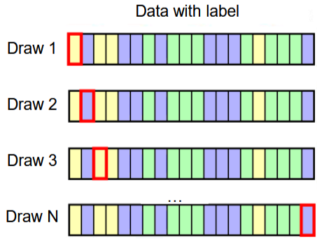

<!-- omit from toc -->
# Strojové učení v počítačovém vidění (NPGR035)

<!-- omit from toc -->
## Úvodem

- :bulb: - zajímavost; prostě jsem něco ještě chtěl říct
- :question: - tady moc netušim, co se děje; potřeba doplnit
- :warning: - na tohle bacha

- pokud to není explicitně uvedeno jinak, váhy všech algoritmů uvažujeme včetně biasu

- některé zpracované otázky byly doplněny o informace z poznámek Júlie Križanové a Dominika Farhana, k nalezení [zde](https://dominik.whizzmot.dev/notes/mlcv/), díky moc
- poznámky vychází z poznatků z jiných předmětů: Vyhledávání ve videu, Úvod do umělé inteligence, Úvod do strojového učení v Pythonu
- není toho tolik - pdfko je nafouklé, protože je tu dost obrázků, zkopírovaný jeden článek a formát má v sobě spoustu prázdného místa

<!-- omit from toc -->
## Obsah

- [Okruh A – vyžaduje sa veľmi detailná odpoveď](#okruh-a--vyžaduje-sa-veľmi-detailná-odpoveď)
  - [1.1 Popíšte SVM a postup jeho trénovania. Čo je to kernel a na čo slúži pri SVM?](#11-popíšte-svm-a-postup-jeho-trénovania-čo-je-to-kernel-a-na-čo-slúži-pri-svm)
  - [1.2 Popíšte dopredné neurónové siete so spätným šírením chyby a postup ich trénovania.](#12-popíšte-dopredné-neurónové-siete-so-spätným-šírením-chyby-a-postup-ich-trénovania)
  - [1.3 Popíšte samoorganizujúce sa mapy a postup ich trénovania.](#13-popíšte-samoorganizujúce-sa-mapy-a-postup-ich-trénovania)
  - [1.4 Popíšte lineárny klasifikátor a postup jeho trénovania.](#14-popíšte-lineárny-klasifikátor-a-postup-jeho-trénovania)
  - [1.5 Popíšte K-means algoritmus, voľbu K a možné alternatívy](#15-popíšte-k-means-algoritmus-voľbu-k-a-možné-alternatívy)
- [Okruh B - vyžaduje sa stredne detailná odpoveď](#okruh-b---vyžaduje-sa-stredne-detailná-odpoveď)
  - [2.1 Popíšte detailne metódu FLDA](#21-popíšte-detailne-metódu-flda)
  - [2.2 Popíšte detailne metódu ICA](#22-popíšte-detailne-metódu-ica)
  - [2.3 Popíšte detailne metódu K najbližších susedov.](#23-popíšte-detailne-metódu-k-najbližších-susedov)
  - [2.4 Aký je rozdiel medzi dvomi základnými prístupmi k znižovaniu dimenzie (wrapper a filter), aké hodnotiace miery sa pri nich používajú?](#24-aký-je-rozdiel-medzi-dvomi-základnými-prístupmi-k-znižovaniu-dimenzie-wrapper-a-filter-aké-hodnotiace-miery-sa-pri-nich-používajú)
  - [2.5 Aký je rozdiel medzi dvomi základnými prístupmi k znižovaniu dimenzie (wrapper a filter), aké postupy sa používajú pri výbere príznakov?](#25-aký-je-rozdiel-medzi-dvomi-základnými-prístupmi-k-znižovaniu-dimenzie-wrapper-a-filter-aké-postupy-sa-používajú-pri-výbere-príznakov)
  - [2.6 Popíšte detailne metódu PCA. Aký je rozdiel medzi PCA a ICA?](#26-popíšte-detailne-metódu-pca-aký-je-rozdiel-medzi-pca-a-ica)
  - [2.7 Popíšte detailne metódu PCA. Akým spôsobom ju používame pri znížení dimenzie?](#27-popíšte-detailne-metódu-pca-akým-spôsobom-ju-používame-pri-znížení-dimenzie)
  - [2.8 Popíšte detailne metódu PCA. Akým spôsobom určujeme počet významých vlastných vektorov?](#28-popíšte-detailne-metódu-pca-akým-spôsobom-určujeme-počet-významých-vlastných-vektorov)
  - [2.9 Popíšte detailne trénovanie Bayesovho klasifikátora. Čo vieme o chybe tohto klasifikátora?](#29-popíšte-detailne-trénovanie-bayesovho-klasifikátora-čo-vieme-o-chybe-tohto-klasifikátora)
  - [2.10 Popíšte ako sa vytvárajú rozhodovacie stromy.](#210-popíšte-ako-sa-vytvárajú-rozhodovacie-stromy)
  - [2.11 Popíšte metódy krížovej validácie a metódu bootstrap. Aký je medzi nimi hlavný rozdiel? Na čo slúžia?](#211-popíšte-metódy-krížovej-validácie-a-metódu-bootstrap-aký-je-medzi-nimi-hlavný-rozdiel-na-čo-slúžia)
  - [2.12 Popíšte detailne konvolučné siete.](#212-popíšte-detailne-konvolučné-siete)
  - [2.13 Popíšte detailne metódy hierarchického zhlukovania.](#213-popíšte-detailne-metódy-hierarchického-zhlukovania)
- [Okruh C – odpoveď pozostáva z 2-3 viet](#okruh-c--odpoveď-pozostáva-z-2-3-viet)
  - [3.1 Čo je matica zámen, ako sa vytvára? Na čo sa používa?](#31-čo-je-matica-zámen-ako-sa-vytvára-na-čo-sa-používa)
  - [3.2 Čo je ROC krivka, ako sa vytvára? Na čo sa používa? Aké hodnoty z nej vieme zistiť?](#32-čo-je-roc-krivka-ako-sa-vytvára-na-čo-sa-používa-aké-hodnoty-z-nej-vieme-zistiť)
  - [3.3 Aké metódy používame pre voľbu trénovacej a testovacej množiny?](#33-aké-metódy-používame-pre-voľbu-trénovacej-a-testovacej-množiny)
  - [3.4 Aký je rozdiel medzi PCA a ICA?](#34-aký-je-rozdiel-medzi-pca-a-ica)
  - [3.5 Aký je rozdiel medzi PCA a LDA?](#35-aký-je-rozdiel-medzi-pca-a-lda)
  - [3.6 Akými spôsobmi normalizujeme príznaky?](#36-akými-spôsobmi-normalizujeme-príznaky)
  - [3.7 Čo je to chybová funkcia klasifikátora? Ako sa odhaduje chyba klasifikátora?](#37-čo-je-to-chybová-funkcia-klasifikátora-ako-sa-odhaduje-chyba-klasifikátora)
  - [3.8 Na čo slúžia filter a wrapper? Aký je medzi nimi rozdiel?](#38-na-čo-slúžia-filter-a-wrapper-aký-je-medzi-nimi-rozdiel)
  - [3.9 Popíšte klasifikáciu pomocou Bayesovho klasifikátora.](#39-popíšte-klasifikáciu-pomocou-bayesovho-klasifikátora)
  - [3.10 Popíšte klasifikáciu pomocou lineárneho klasifikátora.](#310-popíšte-klasifikáciu-pomocou-lineárneho-klasifikátora)
  - [3.11 Popíšte klasifikáciu pomocou rozhodovacích stromov.](#311-popíšte-klasifikáciu-pomocou-rozhodovacích-stromov)
  - [3.12 Popíšte metódu SVD. Na čo slúži?](#312-popíšte-metódu-svd-na-čo-slúži)
  - [3.13 Popíšte miery používané na ohodnotenie príznakov.](#313-popíšte-miery-používané-na-ohodnotenie-príznakov)
  - [3.14 Zadefinujte pojmy entropia a vzájomná informácia. Na čo sa používajú pri výbere príznakov?](#314-zadefinujte-pojmy-entropia-a-vzájomná-informácia-na-čo-sa-používajú-pri-výbere-príznakov)
  - [3.15 Zadefinujte pojmy štatistická nezávislosť a konzistencia. Na čo sa používajú pri výbere príznakov?](#315-zadefinujte-pojmy-štatistická-nezávislosť-a-konzistencia-na-čo-sa-používajú-pri-výbere-príznakov)
  - [3.16 Aké metódy zhlukovania poznáme? Uveďte základné delenie a príklady metód.](#316-aké-metódy-zhlukovania-poznáme-uveďte-základné-delenie-a-príklady-metód)

# Okruh A – vyžaduje sa veľmi detailná odpoveď

## 1.1 Popíšte SVM a postup jeho trénovania. Čo je to kernel a na čo slúži pri SVM?

<!-- omit from toc -->
### Popis

- = *support vector machine*

- klasifikace, regrese

- supervised (s učitelem) algoritmus strojového učení, jehož cílem je najít optimální nadrovinu, která maximalizuje vzdálenosti mezi každými dvěma třídami v N-dimenzionálním prostoru

- *support vectors* viz obrázek

- cílem je mít dělící čáru co nejdále od jednotlivých trénovacích bodů různých tříd

- H1 neodděluje třídy, H2 jo, ale H3 to dělá od pohledu nejlépe (je výsledkem SVM) s maximálními možnými vzdálenostmi:

<!-- omit from toc -->
### Trénování

- cílem je, aby pro všechna data určil SVM správně třídu:
  - $\text{sgn}(w^Tx_i) = t_i$
  - kde $w$ jsou váhy, $x_i, t_i$ jsou $i$-té dato a target
- ... a zároveň je co nejlépe oddělil (nejspíš je to interpretace této podmínky):
  - $\argmax_{w} = \frac12  ||\mathbf{w}||$

- to je (:question: proč) ekvivalentní minimalizaci: 
  - $\argmin_{w} = \frac12  ||\mathbf{w}||^2$

- to vede na odvození pomocí Lagrangiánu
- může se stát, že data nejsou lineárně separovatelná (jsou "skoro linárně separovatelné"), pak použijeme *hinge loss* - pokud je dato špatně zařazeno, tak vrací loss na základě vzdálenosti od dělící čáry 

<!-- omit from toc -->
### Předpovědi

- "na jaké straně nadroviny se dato nachází", $H(f) = {-1, +1}$ (naše dvě třídy), pokud se nachází dato v pásu mezi okraji, tak to lze vracet jinak ($[0,1]$ v závislosti na vzdálenosti)
- $f(x) = \text{sign}(w^Tx)$

<!-- omit from toc -->
### Kernel

- může se stát, že data nejsou lineárně separovatelná, třeba:

- přesto bychom je chtěli umět nějak rozumně rozdělit

- kernel je funkce (nahrazuje skalární součin), která toto umožní - transformuje data z původních features do více dimenzí, kde je možné je separovat

- nejčastější jsou:
  - **polynomiální** - $(ax_1^Tx_2)^p$
  - **gaussian** - $e^{\frac{||x_1 - x_2||^2}{2\sigma ^2}}$

## 1.2 Popíšte dopredné neurónové siete so spätným šírením chyby a postup ich trénovania.

- = *Feedforward neural networks with backpropagation*
- inspirace u reálných neuronových sítí - mozku
- průchod signálu, od začátku do konce, jde pouze jedním směrem (bez zpětné vazby, cyklů atd.)
- Universal Approximation Theorem nám říká, že dostatečně velká neuronová síť dokáže aproximovat jakoukoliv spojitou funkci

<!-- omit from toc -->
### Vrstvy

1) **vstupní vrstva** - neurony, které přijímají data $(x_1, ..., x_n)$

2) **skryté vrstvy** (volitelně mnoho)
   - vrstva neuronů, v každém se spočítá vážený součet všech neuronů v předchozích vrstvě, ten se prožene aktivační funkcí $\sigma(x)$
   - $r_j = \sigma(\mathbf{w}_j^T \mathbf{x})$
   - $r_j$ je skalár a zároveň síla signálu, který neuron vysílá do další vrstvy

3) **výstupní vrstva**
   - pravděpodobností klasifikace, pravděpodobnostní rozdělení, regrese, ... 
   - vrstva neuronů $\rightarrow$ vektor čísel, pravděpodobnostní rozdělení, jedno číslo ...

<!-- omit from toc -->
### Trénování

1) **inicializace vah** - náhodně
2) **dopředný průchod**
   - pro vstup $\mathbf{x}$ se spočítá výstup $\hat{\mathbf{y}}$
   - $\hat{\mathbf{y}}$ se porovná se správnou cílovou hodnotou $\mathbf{y}$, pomocí zvolené nelineární loss funkce $L$ jako $L(\hat{\mathbf{y}}, \mathbf{y})$
3) **zpětné šíření** (= *backpropagation*)
   - od výstupu směrem ke vstupu
   - spočteme gradient ztráty, přičteme k vahám:
   - $\mathbf{W} \leftarrow \mathbf{W} + \Delta \mathbf{W},\; \Delta\mathbf{W} = - \alpha \nabla E\mid_\mathbf{W}$
   - $\alpha$ je learning rate, $E$ je spočtený loss

- trénuje se po jednotlivých snímích nebo batchích, dokud se nepřiblížíme požadované chybovosti 

<!-- omit from toc -->
### Aktivační funkce

- **sigmoid**: $\sigma(x) = \frac{1}{1 - e^{-x}},\; H = (0,1)$
- **ReLU**: $\sigma(x) = \max(0, x)$
- **Tanh**: $\sigma(x) = \frac{e^x - e^{-x}}{e^x + e^{-x}},\; H = (-1,1)$

<!-- omit from toc -->
### Learning rate

- odpovědný za to "jak velký mají updaty vliv na váhy"
- malý *lr* $\rightarrow$ pomalá konvegence
- velký *lr* $\rightarrow$ skáče z místa na místo, nemusí najít lokální optimum
- learning rate je možné upravovat během tréninku podle toho, jaká je chybovost (když se blížíme lokálnímu optimu, chceme zpomalovat)

## 1.3 Popíšte samoorganizujúce sa mapy a postup ich trénovania.

- unsupervised learning
- vysokodimenzionální data $\rightarrow$ nízkodimenzionální (většinou 1D, 2D)
- zjednodušení dat a jejich vizualizace
- *winner-takes-it-all* type beat algoritmus (hladový algoritmus)
- cílem je, aby se neurony navázaly na topologickou strukrutur dat

- "lattice" (:question: speciální matematický konstrukt), často čtvercová nebo šestiúhelníková síť neuronů
- input data jsou propojena se všemi neurony

<!-- omit from toc -->
### Trénink

1) **inicializace vah** - náhodně
2) náhodně vyber input vektor $\mathbf{x}$
3) vyber nejbližší neuron (nejlepší matching)
   - $i^* = \argmin_i ||\mathbf{x} - \mathbf{w}_i||$
4) **update vah** $i^*$ nodu (váhy $\approx$ pozice nodu v prostoru)
5) **update vah sousedních nodů** (ale ne stejně)
   - pomáhá vyrovnat rozdíly ve vahách sousedících nodů
   - dá se specifikovat, jak velký okruh sousedních nodů má být updatem zasažen (například podle vzdálenosti od centra updatu)
   - přenásobení se learning ratem

   - 

   - intenzita updatu se postupně, se vzdáleností od nodu, který vyhrál, zmenšuje
6) opakuje se po daný počet iterací

## 1.4 Popíšte lineárny klasifikátor a postup jeho trénovania.

- pracujeme s datasetem, který má pouze dvě třídy, a ty jsou lineárně separovatelné
- hledáme nadrovinu, která rozdělí prostor na dvě třídy (pokud nejsou lineárně separovetelné, tak ať ho dělí co nejlépe)

- předpověď: $f(x) = \text{sign}(\mathbf{w}^T\mathbf{x})$

<!-- omit from toc -->
### Metoda gradientu

- :question: v prezentaci se tato metoda nazývá *Gradient Method*, za mě je lepší (a snad ekvivalentní) *Gradient Descent*
- iterativně updatujeme dělící nadrovinu, dokud nekonverguje nebo nevyprší čas (podobně jako u SVM)
- gradient nám poví, ve kterém směru se zvětší chyba, a my posuneme váhy přesně na druhou stranu (věříme, že se tím směrem chyba zmenší):
  - $u_{i+1} = u_i - \alpha(i)\nabla O\mid_{u_i}$
- kde $O(x)$ je funkce, která je $0$, když jsou všechny objekty správně klasifikované; $\alpha(i)$ je learning rate v kroku 

- ideální $\alpha$ lze najít pomocí Tyalorova rozvoje (více v *Križanová, Farhan*) 

<!-- omit from toc -->
### Data processing

- **batch processing**:
  - gradinet loss funkce se spočítá na celé trénovací množině
  - průměrná ztráta přes všechny příklady
- **single processing**:
  - váhy se updatují na základě jednoho data z trénovací množiny
  - každé dato příspívá samo
- :bulb: **mini-batch**:
  - trénovací data se rozdělí na skupiny po $m$ datech
  - váhy se updatují vždy podle jedné této skupiny

| | **Batch**| **Single**|
|-|-|-|
| **Gradient**|vypočítaný přes všechny vzorky | vypočítaný pro jeden vzorek|
| **Rychlost aktualizace**| pomalejší (celá množina dat)| rychlejší (jednotlivé vzorky)|
| **Přesnost gradientu**  | přesný| méně přesný, ovlivněn šumem|
| **Konvergence**| stabilní, ale pomalá| rychlá, ale oscilující|
| **Vhodné pro**| malé datasety| velké datasety|

## 1.5 Popíšte K-means algoritmus, voľbu K a možné alternatívy

- algoritmus se snaží rozdělit data do $k$ clusterů

<!-- omit from toc -->
### Trénování

1) **inicializace**
   - $K$ bodů se náhodně rozmístí do prostoru
   - jsou to počátěční *group centroids*
2) **přiřazení**
   - každý objekt se přiřadí k nejbližšímu možnému centroidu
3) **rekalkulace**
   - přepočítá pozice centroidu $c$ v prostoru vzhledem k přiřazeným objektům
   - průměr pozic přiřazených objektů (součet vektorů přiřazených centroidu / počet vektorů přiřazených centroidu):
    - $$c_\text{updated} = \frac{\sum_{\{x | C(x) = k\}}x}{N_k}$$
   - intepretace: posuneme centroid do těžiště bodů, které mu byly přiřazeny
4) **opakuj** od 2)
   - dokud není $\text{MSE} < \text{threshold}$, nebo se mění clustering

- **výhody**
  - vždycky konverguje
  - vždycky dosáhne lokálního optima (ne nutně globálního)

- **nevýhody**
  - citlivý na outliers a šum
  - 
  - citlivý na počáteční náhodné umístění centroidů
  - nedeterministický, výsledky nejsou konzistentní
  - 

<!-- omit from toc -->
### Volba $K$

<!-- omit from toc -->
#### Elbow method

- počítá WSS
- "***SSW = WSS**: The SSW is the sum of squared differences between a value and its sample mean for all values.*"

<!-- omit from toc -->
#### Gap value

- měří, jak dobré je naše clusterování oproti náhodně generovaným datům se stejnými centroidy (aka jak moc je to lepší, než random)
- $\text{Gap}_N(K) = \mathbb{E}[\log W^{\text{ref}}_K] - \log W_K$
- $W_K = \sum_{k=1}^K \frac{1}{2N_K} WSS_K$
- volíme takové $K$, které je největší nebo se za ním skóre významně nezlepšuje

<!-- omit from toc -->
#### The silhouette value

- měří, jak moc jsou body v clustseru podobné ostatním bodům v ostatních clusterech
- $S(i) = \frac{b(i) - a(i)}{\max (a(i), b(i))}$
- $a(i)$ - průměrná vzdálenost $i$-tého objektu od ostatních ve stejném clusteru
- $b(i)$ - minimální průměrná vzdálenost $i$-tého objektu od objektů v ostatních clusterech (minimalizujeme přes clustery)
- různě zvolená $K$ dají různé siluety, cílem je najít $K$ s dostatečně dobrým průměrným $S(x)$

<!-- omit from toc -->
#### :bulb: Silhouette value lepší vysvětlení

> [zdroj](https://www.baeldung.com/cs/silhouette-values-clustering)

<!-- omit from toc -->
##### Silhouette Plots

The silhouette of a cluster visualizes the silhouette values $s_i$ of all the points in it in the decreasing order. A silhouette plot shows the silhouettes of all the clusters in random order. Additionally, it inserts blank spaces between consecutive clusters and can color them differently.

For example, here’s a plot for four clusters we got with the K-Means clustering algorithm on an ad-hoc two-dimensional dataset:
Average silhouette score $0.71$:

Here, we set $k=2$. On the left, we have the silhouette plot. The x-axis shows the silhouette values, and the height of each silhouette indicates the number of points in the corresponding cluster. The right subplot visualizes the data points with the same colors as the clusters. The red line shows the average silhouette value for all the clusters. In this example, the average value is $0.71$.

From the right subplot, we conclude that the cohesion of the green points is higher than that of the black ones. This should explain the worse silhouette of the black cluster on the left. However, the two clusters look well separated.

<!-- omit from toc -->
##### Choosing the Number of Clusters

By plotting the silhouettes for different values of $k$ we can see which $k$ best fits the data.

For instance, the following graphic shows the K-Means results for the above data and $k = 3$. The average silhouette value increases to $0.78$:

Here, we see that the right cluster remains intact, while the left one splits into two smaller ones. These two clusters have better silhouette values than the ones obtained by the blue cluster, but all three appear to be well defined.

What happens if we use $k=4$? The average silhouette value drops slightly to $0.74$:

Here, we see that the green and black clusters have better silhouettes than the other two. It’s probably because their points are better separated than the points of the other two clusters.

Finally, the average silhouette values for $k=5$ drops to $0.66$ and $0.53$:

and for $k=6$ to $0.53$:

So, $k=2,3,4$ appear to be good choices, whereas $k=5$ and $k=6$ give lower-quality clusters.

<!-- omit from toc -->
### Alternativy

1) **K-medoids**
   - místo means použijeme medoids
   - medoid = objekt, který je součástí dat (aka jedno dato)
2) **K-medians**
   - místo means se použijí mediány
3) **Fuzzy C-means**
   - objekt částečně patří do více clusterů

# Okruh B - vyžaduje sa stredne detailná odpoveď

## 2.1 Popíšte detailne metódu FLDA

- = *Fisher LDA* = *Linear Discriminant Analysis*
- supervised method
- redukce dimenze a klasifikace dat do tříd
- cílem je najít prostor featur, který optimalizuje vzathy uvnitř tříd a vztahy mezi třídami:
  - v nové projekci musí být data v různých třídách co nejdále od sebe
  - data, která jsou společně v jedné třídě, musí být naopak co nejblíže
  - maximalizujeme poměr rozptylů mezi třídami a uvnitř tříd

- máme data $\{\mathbf{x}_1, \mathbf{x}_2, ..., \mathbf{x}_N\} \subset \mathbb{R}^d$
- pro každou třídu $j$ průměr dat (střed třídy):
- $$\mu_j = \frac{1}{N_j} \sum_{\mathbf{x} \in \omega_j}$$
- a průměr všech dat:
- $$\mu = \frac{1}{N} \sum_{i=1}^N\mathbf{x}_i$$
- **total scatter** (= totální rozptyl dat):
- $$S = \sum_{i=1}^N(\mathbf{x}_i - \mu)(\mathbf{x}_i - \mu)^T$$
- :warning: $S$ není skalár, ale matice $\in \mathbb{R}^{d\times d}$
- $$S = S_M + S_V$$

- **Interclass scatter** (= mezi průměrem třídy a celkem):
- $$S_M = \sum_{j=1}^C N_j (\mu_j - \mu)(\mu_j - \mu)^T$$

- **Intraclass scatter** (= součet rozptylů jednotlivých tříd od celku, průměru):
- $$S_V = \sum_{j=1}^C S_j$$
- kde $$S_j = \sum_{\mathbf{x} \in \omega_j}(\mathbf{x} - \mu_j)(\mathbf{x} - \mu_j)^T$$

- $\mathbf{w}$ je projekce dat do nového prostoru ($x_i' = \mathbf{w}^T\mathbf{x}_i$) pro dvě třídy, pro $C$ tříd je to $\mathbf{W} = [\mathbf{w}_1\mid\mathbf{w}_2\mid ... \mid \mathbf{w}_{C-1}]$

- minimalizujeme *Fisher's criterion*:
- $$J(\mathbf{W}) = \frac{|\mathbf{W}^T S_M \mathbf{W}|}{|\mathbf{W}^T S_V \mathbf{W}|}$$

- to se dá řešit obecně přes hledání vlastních vektorů (v prezentaci to je rozepsané víc, nepřijde mi důležité umět to nazpaměť, výše je materiálu na povídání dost :question:)
- $$(S_M - S_V \lambda)\mathbf{w} = 0$$

## 2.2 Popíšte detailne metódu ICA

- = *Independent Component Analysis*

- snižování dimenze, oddělování komponent, rozklad na statisticky nezávislé komponenty

<!-- omit from toc -->
### Princip

- máme $n$ pozorování $\mathbf{X} = (\mathbf{x}_1, \mathbf{x}_2, ..., \mathbf{x}_n)$ a $m$ nezávislých zdrojových signálů $\mathbf{s}$
- $\mathbf{x}$ vznikají jako lineární kombinace $\mathbf{s}$, tedy $\mathbf{x} = A\mathbf{s}$
- chceme najjít $W$, $\mathbf{s} = W \mathbf{x}$ (recept, jak namíchat signály)

<!-- omit from toc -->
### Předpoklady pro funčkní ICA

- prvky $\mathbf{s}$ jsou statisticky nezávislé
- $E(\mathbf{s}_i) = 0$, data jsou nekorelovaná
- $\text{Var}(\mathbf{s}_i) = 1$
- non-Gaussianity = signál má rozdělení odlišné od gaussovského rozdělení (:bulb: díky tomu se dají identifikovat nezávislé komponenty)
- $|\mathbf{x}| \geq |\mathbf{s}|$, abychom mohli signály spolehlivně rozeznat
- :question: $\implies$ "$E\{SS^T\} = I$", "covariance matrix is unit matrix"

<!-- omit from toc -->
### Preprocessing 

- aby se data chovala podle našich požadavků

1) **centrování**
   - odečtení průměru, průměr dat je nula
   - $\mathbf{X}' = \mathbf{X} - \bar{\mathbf{X}}$
2) **whitening**
   - aplikuje transformaci $B$
   - $\tilde{\mathbf{X}} = B\mathbf{X}'$ tak, aby $\sum_{\tilde{\mathbf{X}}} = I$ :question:
   - $B$ najdeme pomocí vlastních vektorů

<!-- omit from toc -->
### Výpočet

- optimalizace směru $\mathbf{w}_i$, abychom maximalizovali non-Gaussianity
- $\mathbf{Y} = W \mathbf{X}$
- měření podle třetího a čtvrtého central moment - výpočetně náročné

- můžeme to spočítat pomocí *Negentropy* = "distance to normality"
- $J(y) = H(y_G) - H(y) \approx J(y) \propto (E(G(y)) - E(G(y_G)))^2$
- druhý člen mocnění je konstantní, dále se řeší pomocí Lagrangeových koeficientů

<!-- omit from toc -->
### ICA nevýhody

- váhy jednotlivých signálů nelze určit
- nelze určit znaménko signálu
- pořadí signálů nelze určit

- :bulb: výpočetně náročné, striktní předpoklady

<!-- omit from toc -->
### :bulb: FastICA

- ve zkratce: postupné updatování transformace na základě feedbacku z předpovědí (asi)

1. náhodný starting vector $\mathbf{w}$
2. $\mathbf{w}^+ = E\{\mathbf{x} g(\mathbf{w}^T \mathbf{x})\} - E\{g'(\mathbf{w}^T \mathbf{x})\} \mathbf{w}$
3. $\mathbf{w} = \frac{\mathbf{w}^+}{\|\mathbf{w}^+\|}$
4. opakuj 2., 3., dokud nekonverguje

- lze rozšířit pro více dimenzí, viz prezentace

<!-- omit from toc -->
### :bulb: Redukce dimenze

- pro snížení dimenze použijeme pouze nejvýznamějších $k$ zdrojových signálů, které nám vyjdou v ICA

## 2.3 Popíšte detailne metódu K najbližších susedov.

- :question: V prezentaci se tento algoritmus odvozuje z Bayesova pravidla, pak se ukazuje weighted verze. Při zpracování této otázky vycházím z "Úvod do strojového učení" a Bayesovi se úplně vyhýbám.

- co je potřeba?
  - množina trénovacích dat
  - metrika pro počítání vzdálenosti
  - hodnota $K$ (kolik sousedů hledáme)

<!-- omit from toc -->
### Trénink

- uložíme si všechna data
- to je potřeba dělat efektivně:
  - **efektivní struktury**: kd-trees, ball trees
  - **redukce** množství dat: výběr pouze nejdůležitějších dat
    - **editing** - odstranění bodů, které se neshodují s většinou svých $K$ sousedů
    
    - **condensing** - zachová jen body, které jsou potřeba k definování dělící čáry
    - 

<!-- omit from toc -->
### Predikce

- pro $\mathbf{x}$ předpovídáme pomocí nejbližších (podle toho, jakou si nadefinujeme normu) $K$ sousedů z trénovacích dat

- predikce **regrese**:
  - $$t = \sum_i \frac{w_i}{\sum_j w_j}t_i$$
  - $K$ sousedů má hodnoty (skaláry) $t_i$
  - $w_i$ je váha třídy $i$
  - zlomek uvnitř sumy normalizuje váhy tak, aby byly pravděpodobnostní distribucí

- predikce **klasifikace**: je predikována nejčastější třída (`np.bincount`) 
  - $$\boldsymbol{t} = \sum_i \frac{w_i}{\sum_j w_j}\boldsymbol{t}_i$$

  - $\boldsymbol{t}_i$ jsou distribuce v kategoriích, $\boldsymbol{t} \in \mathbb{R}^d$, kde $d$ je počet tříd, se kterými pracujeme
  - (kdybychom měli šest tříd, $K = 5$, třikrát potkali druhou třídu a dvakrát čtvrtou, tak by to mohlo vypadat nějak takto: $\mathbf{t} = (0,3,0,2,0,0)^T$, pak se to po prvcích vynásobí s váhami a máme předpověď)

- klasifikace vrací pravděpodobnostní rozdělení přes třídy, regrese vrací skalár

<!-- omit from toc -->
### Normy

- **$L_p$ norma**: 
  - $$||x - y||_p = \left(\sum_i |x_i - y_i|^p\right)^{1/p}$$
  - standardně je to $1$ (Manhattanská), $2$ (Euklidovská), $3$, ..., $\infin$ (maximová)

<!-- omit from toc -->
### Hlasování

- při předpovídání můžeme použít různé váhy pro různé hlasy

- **uniform**: hlas každého z $k$ sousedů má stejnou váhu
- **inverse**: váha hlasu je úměrná 1/vzdálenost (hlas je dál, má nižsí váhu)
- **softmax**: váha hlasu je $\text{softmax}$(- vzdálenost)

<!-- omit from toc -->
### Jak vybírat $K$?

- **zvyšování** $K$:
  - odolnější vůči šumu
  - jemnější okraj
- **snižování** $K$:
  - zachycení složitějších struktur (víc jagged okraje)

- obecné pravidlo: "zvol $K$ tak akorát", hlavně to vyzkoušej s validačním datasetem

## 2.4 Aký je rozdiel medzi dvomi základnými prístupmi k znižovaniu dimenzie (wrapper a filter), aké hodnotiace miery sa pri nich používajú?

- chceme-li redukovat dimenze dat (počet featur), můžeme použít přístup *feature selection*, to se dá dělat dvěma způsoby:

<!-- omit from toc -->
### Filter

- nezávislý na modelu, features vybírá na základě jejich vlastností
- hodnocení relevance atributů pomocí statistiky

<!-- omit from toc -->
### Wrapper

- závislý na modelu, features vybírá tak, aby optimalizoval výsledky modelu
- výpočetně náročné (model se musí natrénovat, poté evaluovat)

<!-- omit from toc -->
### Metriky filtru

- **consistency**
  - podmnožina featur musí objekty klasifikovat stejně jako celý množina
  - *inconsistency* - objekty se stejnými featurami patří do jiných tříd
  - nemůžeme osekat data jen na "hair" a "height", protože by $i_4$ a $i_8$ měly stejné features, ale jinak by se klasifikovaly:
  - 
  - 
- **independence**
  - 
  - 
  - 
- **information-theoretical measures**
  - Hartley's information measure
    - délka informace (zprávy): $n$
    - velikost abecedy: $s$
    - užitek informace je odvozen od počtu možných informací (zpráv)
    - $\Im = n \log s$
  - Shannon's information measure
    - diskrétní náhodná proměnná $A$ s možnými stavy $\{a_1, ..., a_n\}, P(A=a_i)=p_i$
    - užitek po pozorování $A$:
    - $\Im = - \log (P(A=a_i))$
    - interpretace: po pozorování méně častého eventu získáme více informace
    - z toho se dá odvodit entropie jako:
    - $H(A) = \mathbb{E}(\Im)$
  - 
- **interclasss distance**
  - 
  - "Intraclass distance is the distance between two points that are in the same class.  
    An **intra-class distance** is the distance between measurements $X_i$ and $X_j$, where $(i, j \in 1 \cdots N)$, and $X_i$ and $X_j$ are members of class $C$. One usually takes an average over the distances from all possible $(i, j)$ pairs within class $C$, and uses it as the objective function.  
    You can also use the distance between $X_i$ and $\bar{X}_C$ (the average coordinate of all measurements in class $C$), and take the average of this over all measurements in class $C$.  
    In contrast, an **inter-class distance** is the distance between measurements $X_i$ and $X_j$, where $X_i$ and $X_j$ are members of different classes."

<!-- omit from toc -->
### Metriky wrapperu

- jsou shodné s metrikami pro hodnocení modelů
- accuracy, error rate, F-score

<!-- omit from toc -->
### Hlavní rozdíly

| **Kriterium** | **Filter** | **Wrapper** |
| --- | --- | --- |
| **Závislost na modelu** | nezávislý | závislý |
| **Rychlost** | rychlejší | pomalý |
| **Hodnotící metriky** | statistické (korelace, entropie apod.) | výkonnost modelu (přesnost, F1 apod.) |
| **Obecnost** | obecný postup | specifický pro konkrétní model | 

## 2.5 Aký je rozdiel medzi dvomi základnými prístupmi k znižovaniu dimenzie (wrapper a filter), aké postupy sa používajú pri výbere príznakov?

- úvod je stejný jako u otázky výš

<!-- omit from toc -->
### Vybírání featur

- máme $|X| = n$ featur a chceme jich vybrat $k$

- **one step forward selection**
  - spočítej skóre všech featur, vyber top $k$
- **sequential forward selection**
  - mějme $\tilde{X} = \emptyset$
  - pro každou featuru $f_j \in X$ spočítej skóre $\tilde{X} \cup \{f_j\}$
  - přiřaď nejlepší featuru do $\tilde{X}$
  - opakuj, dokud nemáš $k$
  - interpretace: jaká nová feature nejvíc zlepší už vybranou množinu
- **one step backward elimination**
  - spočítej skóre všech featur, odstraň nejhorších $n-k$
  - :question: je tohle ekvivalentní s OSFS?
- **sequential backward elimination**
  - mějme $\tilde{X} = X$
  - pro každou featuru $f_j \in \tilde{X}$ spočítej skóre $\tilde{X}\setminus\{f_j\}$
  - odstraň featuru s největším skóre z $\tilde{X}$
  - opakuj, dokud není odstraněno $n-k$ featur
  - interpretace: "nejzbytečnější featuru dej pryč" - množina zbylých featur má po jejím odstranění největší skóre
- **combined selection and elimination**
  - 

- :bulb: další možné způsoby výběru:
  - **genetické algoritmy**
  - **Simulated annealing**
    - "a probabilistic technique for approximating the global optimum of a given function. Specifically, it is a metaheuristic to approximate global optimization in a large search space for an optimization problem."

## 2.6 Popíšte detailne metódu PCA. Aký je rozdiel medzi PCA a ICA?

- = *Principal Component Analysis*
- jediné, co nás zajímá, je souvislost featur mezi sebou, na základě toho můžeme transformovat featury do méně dimenzí
- unsupervised
- rotace a translace os tak, aby aby nové osy byly ve směru maximální variace dat
- :question: v prezentaci je sposuta slidů, kde se PCA odvozuje; tady to přeskočím

<!-- omit from toc -->
### Agolritmus

- před výpočtem je nutné data standardizovat

- máme $D$ dat s $N$ featurami, jednotlivá data jsou řádky matice: $\mathbf{X} = [\mathbf{x}_1, ..., \mathbf{x}_D]^T \in \mathbb{R}^{D\times N}$

1) spočteme matici kovariance (covariance matrix):
   - $\mathbf{\Sigma} = \frac{1}{N} \mathbf{X}\mathbf{X}^T$
2) najdeme vlastní vektory:
   - $\mathbf{\Sigma}\mathbf{b}_j = \lambda_j \mathbf{b}_j$
3) transformujeme vektory:
   - $\mathbf{X}' = \mathbf{B}^T\mathbf{X}$

<!-- omit from toc -->
### Rozdíl mezi PCA a ICA

- v PCA jsou na sebe komponenty kolmé, v ICA to neplatí (ICA tedy dokáže zachytit věci, které PCA nedokáže)

- PCA komprimuje informace, ICA je odděluje
- PCA hledá korelované komponenty, ICA hledá nezávislé komponenty

## 2.7 Popíšte detailne metódu PCA. Akým spôsobom ju používame pri znížení dimenzie?

- úvod je stejný jako u otázky výš

- chceme data redukovat $k$ featur
- místo toho, abychom transformovali vektory celým spočteným $\mathbf{B}$, vezmeme jenom $k$ vlastních vektorů (nejlépe těch nejvýznamějších)
- data přenásobíme touto redukovanou maticí

## 2.8 Popíšte detailne metódu PCA. Akým spôsobom určujeme počet významých vlastných vektorov?

- úvod je stejný jako u otázky výš

- $n$ komponent (vlastních vektorů) seřadíme sestupně podle velikosti vlastních hodnot, které k nim patří
- vybereme $k$ nejdůležitějších komponent ("vysvětlují data"), k tomu použijeme metriku *Cumulative Explained Variance*, většinou chceme, aby byla $> 0.9$, nebo $>0.95$:

$$\text{CEV} = \frac{\sum_{i=1}^k \lambda_i}{\sum_{i=1}^n \lambda_i} > 0.9 \;(> 0.95)$$

- interpretace: při snižování dimenze nám stačí, když původní data "zachováme/interpretujeme/vysvětlujeme" s "přesností" 90 %

## 2.9 Popíšte detailne trénovanie Bayesovho klasifikátora. Čo vieme o chybe tohto klasifikátora?

- vychází z Bayseova pravidla:
  - $$P(A\mid B) = \frac{P(B\mid A)P(A)}{P(B)}$$

- *naive Bayes classifier* předpokládá, že jsou featury statisticky nezávislé

- cílem je objektu $x$ (feature vektor) přiřadit třídu $\omega_i$, která je nejvíce pravděpodobná při pozorování $x$, takovou pravděpodobnost spočteme jako:
  - $$P(\omega_i \mid x) = \frac{P(x\mid \omega_i)P(\omega_i)}{P(x)}$$
  - je potřeba vědět:
    - $P(x\mid \omega_i)$ - jak pravděpodobný je objekt $x$ ve třídě $\omega_i$
    - $P(\omega_i)$ - jak pravděpodobná (častá) je třída $\omega_i$
    - $P(x)$ - jak pravděpodobný je výskyt objektu $x$

<!-- omit from toc -->
### Predikce

- bayesovský klasifikátor přiřadí objekt $x$ do třídy $\omega_i$, jestliže $\forall \omega_j, j\not = i$:
  - $$\frac{P(x\mid \omega_i)P(\omega_i)}{P(x)} \geq \frac{P(x\mid \omega_j)P(\omega_j)}{P(x)}$$
- protože je $x$ konstatní, dá se hledání takové třídy zjednodušit:
  - $$\omega_i = \argmax_{\omega_j} P(x\mid \omega_j)P(\omega_j)$$

<!-- omit from toc -->
### Chyba

- chybu lze spočítat jako množství všech příkladů, které jsou pravděpodobné v nějaké třídě, ovšem nejsou do ní zařazeny, protože jiná třída je pro pravděpodobnější

- $$P(e) = \int_{R_1} P(x, \omega_2)dx + \int_{R_2} P(x, \omega_1)dx$$

- pokud bychom s hranicí tříd hýbali, mohli bychom způsobit větší chybu klasifikátoru - z pohledu takovéhoto výpočtu chyby je tento přístup optimální

## 2.10 Popíšte ako sa vytvárajú rozhodovacie stromy.

- strom má
  - **vrcholy** - obsahuje test na jednu featuru
  - **hrany** - odpovědi na testy ano/ne
  - **listy** - určuje třídu klasifikovaného objektu

<!-- omit from toc -->
### Algoritmus predikce

- dokud nejsi v listu:
  - proveď test ve vrcholu:
    - ano $\rightarrow$ vydej se "ano" hranou
    - ne $\rightarrow$ vydej se "ne" hranou
- vrať třídu v listu

<!-- omit from toc -->
### Trénovaní stromu

- **testy**:
  - testy ve formátu $F_k \leq \alpha$, aka "je k-tá featura menší nebo rovna $\alpha$"
  - dělí podmnožinu trénovacích dat, které sem došla, na dvě části

- **splitting criterion**:
  - funkce, která nám na základě podmnožiny trénovacích dat řekne, podle které feature máme splitovat a jak velký má být threshold $\alpha$
  - chceme data efektivně rozdělit tak, aby všechna data ze třídy spadla do stejné odpovědi ano/ne - to se často nepovede na sto procent a je tedy potřeba měřit, jak efektivně se nám podařilo data rozdělit

  - **Variable quality measure**
    - definujeme míru *impurity* $I$, která spňuje několik předpokladů:
    - 
    - nejlepší featura pro split, je taková která maximalizuje snížení *impurity*:
    - $$\Delta I (S, F_i) = I(S) - \sum_j \frac{|S_{ij}|}{|S|} I(S_{ij})$$
    - = impurity vstupních dat - pravděpodobnost, že skončíme v této branchi $\cdot$ impurity množin, na které se vstup rozdělí
    - jedna z možných impurity measures je *Gini-index* - "jak často špatně klasifikujeme, pokud klasifikujeme podle distribuce tříd"
    - nebo třeba *Mutual information*

- **stop-splitting rule** - kdy máme zastavit dělení a prohlásit vrchol za list?
  - impurity vrcholu je menší než předem daný threshold
  - kardinalita (počet dat, která došla do vrcholu) je dostatečně malá
  - node je pure (všechna data jsou z jedné třídy)
- **classification rule**:
  - poté, co nějaký vrchol prohlásíme za list, musíme rozhodnout, jaký bude mít label (aka co bude predikovat, když do něj dojdem)
  - **pravidlo většiny** - predikujeme to, co říká většina

<!-- omit from toc -->
### Algoritmus konstrukce

- $S$ je trénovací dataset, $A$ jsou featury, $y$ jsou targety

- po konstrukci je možné dělat *pruning*

<!-- omit from toc -->
### Výhody

- jednoduché na interpretaci
- skoro žádná příprava dat, výpočetně nenáročné předpovědi
- jasně indikuje, které featury jsou nejdůležitější pro klasifikaci

<!-- omit from toc -->
### Nevýhody

- najít optimální decision tree je NP-complete problem
- hodně tříd, málo dat $\rightarrow$ špatné výsledky
- výpočetně náročný trénink
- příliš komplexní stromy $\rightarrow$ overfitting

<!-- omit from toc -->
### :bulb: Random forest

- zkonsturuujeme několik decision trees, ale v průběhu jejich konstrukce vybíráme data a featury z náhodné podmnoižiny, abychom zabránili vzniku podobných (stejných) stromů
- předpovídají všechny stromy, o výsledku hlasují

## 2.11 Popíšte metódy krížovej validácie a metódu bootstrap. Aký je medzi nimi hlavný rozdiel? Na čo slúžia?

<!-- omit from toc -->
### Bootstrap

- máme $N$ dat, která nasamplujeme
  - **traning set**: $N$ náhodně vybraných dat (stejné dato může být vybráno víckrát)
  - **test set**: data z původního datasetu, která se nenachází v training setu

- $0.632$ bootstrap - pravděpodobnost, že dato skončí v training setu je $63.2$ % ($\impliedby 1 - (1 - 1/N)^N \approx 1 - e^{-1}$)

<!-- omit from toc -->
### Cross validation

- při vyhodnocování modelu (zvláště na malém datasetu) může být jeden run (rozdělení datasetu na train/test) nedostačující
- to se dá vyřešit cross validací
  - dataset rozdělíme na $k$ podmnožin
  - na jedné testujeme, na ostatních trénujeme; to uděláme $k$-krát
  - spočteme průměrnou chybu

<!-- omit from toc -->
#### Dělení dat

- **random subsampling**
  - data náhodně rozházíme do $k$ skupin
  - 
- **K-fold**
  - rozdělení datasetu na $k$ stejně velkých podmnožin
  - 
- **stratified K-fold**
  - rozdělení datasetu na $k$ stejně velkých podmnožin, ve kterých je distribuce dat stejná (podobná) jako v celém datasetu
  - 
- **leave one out**
  - testujeme pouze na jednom datu, všechny ostatní jsou training data
  - 

<!-- omit from toc -->
#### Výběr $k$

- nejčastěji $10$, pro velké datasety stačí $k=3$
- pro malé datasety je nejlepší *Leave one out*

<!-- omit from toc -->
### Hlavní rozdíly

- cross validation dělí původní dataset, bootstrap z něj sampluje data
- bootstrap náhodně sampluje data, cross validation ne
- bootstrap 

## 2.12 Popíšte detailne konvolučné siete.

- ve zkratce: input $\rightarrow$ konvoluční filtr $\rightarrow$ pooling $\rightarrow$ konvoluční filtr $\rightarrow$ ... $\rightarrow$ pooling $\rightarrow$ fully connected network (klasická neuronka)

- první taková CNN se jmenovala AlexNet a používala se ke klasifikaci obrázků
- pooling a konvoluční vrstvy postupně zpracují obrázek, dokud se nestane "hodně dlouhým vektorem", který se pošle do fully connected NN, která je zodpovědná za klasifikaci

<!-- omit from toc -->
### Konvoluční filtr (kernel):
- konvoluční vrstva v NN modifikuje vstupní data na základě masky (filtru) s váhami
- má rozměr $m\times n$ a váhy, které každé z $m \times n$ buněk dávají nějakou váhu
- výstupem je vážený součet vstupních čísel, skalár

- v computer vision se tyto filtry používají na:
  - edge detection
  - blurring
  - sharpenning

<!-- omit from toc -->
### Pooling layer

- snižuje dimenzi dat a počty parametrů
- nejčastější je max pooling, dělá se ale i average a sum
  

- **receptive field** - "co všechno vidí neuron"

<!-- omit from toc -->
### Použití

- klasifikace dosud neviděných obrázků
- extrakce featur - dlouhý vektor, před vstupem do fully connected NN, se dá použít jako featury obrázku (třeba k vyhledávání podobných obrázků, funguje tu dobře cosinová vzdálenost, viz Vyhledávání ve videu)

<!-- omit from toc -->
#### Pretrained modely

- když máme model s natrénovanými filtry, můžeme je znovu použít někde jinde
- zafixujeme filtry a řeším jen váhy ve fully connected vrstvě
- "Sometines CNNs are pretrained on a different problem and then inserted into a new model with freezed weights. They can extract features well and on their output another model not necessarily CNN is trained."

## 2.13 Popíšte detailne metódy hierarchického zhlukovania.

<!-- omit from toc -->
### Dendrogram

- znázorňuje, jak jsou data rozřazena do clusterů
- pokud strom přetneme v nějaké výšce, pak máme rozdělení do clusterů v určité hloubce

<!-- omit from toc -->
### Metody dělení

- **divisive approach**
  - všechny objekty dáme do jednoho clusteru
  - vybereme custer na splitování a splitneme ho (podle předem zadefinovaného kritéria)
  - opakujeme (dokud nemáme chtěný počet clusterů, nebo nejsou clustery už jednotlivé objekty)
- **DIANA** (divisive analysis)
  - nejzákladnější algoritmus
  - vezmi objekt, který je nejvíce odlišný od všech ostatních a dej ho do vlastního, druhého, clusteru
  - pro každý objekt porovnej vzdálenost mezi prvním a druhým clusterem, pokud je blíže k druhému, dej ho tam
  - opakuj, dokud nezařadíš všechny objekty tam, kam patří
  - 
  - (tento posotup lze opakovat pro další dělení právě vzniklých clusterů)
- **principal directions divisive partitioning** (PDDP)
  - najdi *principal axis* (hlavní směr, jako v PCA)
  - data rozděl podle projekce na hlavní směr
  - opakuj pro každý cluster, dokud nejsme spokojeni
- **median cut**
  - idea, že clustery budou stejně velké
  - najdi nejmenší bounding box pro všechny
  - po nejdelší straně bboxu najdi medián mezi objekty
  - 
  - splitni box na dva clustery v oblasti mediánu
  - opakuj, dokud nejsme spokojeni
  - 
- **aglomerative clustering**
  - jednotlivé objekty jsou clustery
  - merguj dva sobě nejbližší clustery (podle předem definované metriky)
  - opakuj, dokud všechny objekty nejsou v jednom clusteru
  - 

<!-- omit from toc -->
### Vzdálenost clusterů

- máme clustery $A$ a $B$
- **single-link**
  - vzdálenost nejbližších bodů $A$ a $B$
- **complete-link**
  - vzdálenost nejvzdálenšjích bodů $A$ a $B$
- **centroid-link**
  - vzdálenost centroidů
- **average-link**
  - průměrná vzdálenost mezi všemi dvojicemi objektů v $A$ a $B$

- **Ward's method**
  - počítá cenu mergování clusterů $A$ a $B$
  - $N_k$ počet objektů v clusteru, $c_k$ centroid clusteru
  - $$C_{A,B} = \frac{N_A N_B}{N_A + N_B} ||c_A - c_B||^2$$

- **iterative shrinking**
  - jednotlivé objekty jsou clustery
  - odstraň cluster s nejmenší cenou (crazy vzorec)
  - 
  - rozděl prvky z clusteru do ostatních
  - 
  - 

# Okruh C – odpoveď pozostáva z 2-3 viet

## 3.1 Čo je matica zámen, ako sa vytvára? Na čo sa používa?

- = *confusion matrix*
- nejčastěji matice $2 \times 2$
- názvy kategorií jsou "trefil jsem se? - ground truth" (takže třeba *false positive* znamená, že jsem se netrefil a správně bylo říct "ano")

- používá se k evaluaci modelu, můžeme vidět, jak si vede v různých kategoriích

## 3.2 Čo je ROC krivka, ako sa vytvára? Na čo sa používa? Aké hodnoty z nej vieme zistiť?

- = *receiver operating characteristics*

- **true positive rate**
  - $$\text{TPR} = \frac{\text{TP}}{\text{TP} + \text{FN}}$$
  - interpretace: poměr správně identifikovaných positiv
- **false positive rate**
  - $$\text{FPR} = \frac{\text{FP}}{\text{FP} + \text{TN}}$$
  - interpretace: poměr špatně identifikovaných pozitiv jako negativ

- vnitřní funkce modelu nám vrátí nějakou pravděpodobnost, že objekt náleží do určité třídy, náš classifier se pak na základě předem daného thresholdu rohodne, jestli objekt zařadí do navržené třídy, nebo ne (například: "je to pes s pravděpodobnostní $0.13$" není přesvědčivé tvrzení, můžeme nastavit threshold třeba na $0.5$)
- ROC curve je plot TPR oproti FPR v každém možném nastavení thresholdu (aka vezmu threshold, spočítám pro něj TPR, FPR, plotnu)

- z křivky lze vidět, jestli je náš model lepší než model, který náhodně rozděluje data do tříd $50/50$
- čím blíž, je křivka levému hornímu rohu, tím blíž je model ideálnímu modelu (to by znamenalo, že model všechno predikuje správně bez false positives)
- máme-li dva modely, můžeme je spolu porovnat pomocí ROC curve

- **AUC** - area under curve
  - pravděpodobnost, že náhodné positive dato bude předpovězeno jako positive
  - podle AUC se dá říct, jak si model vede: perfektní, výborné, dobé, náhodné - $1.0, 0.9, 0.7, 0.5$

## 3.3 Aké metódy používame pre voľbu trénovacej a testovacej množiny?

- před trénováním modelu je potřeba rozdělit data na train/test
- model se nesmí nikdy učit z test dat
- pokud chceme testovat v průběhu tréninku na něčem, co model nikdy neviděl, jak potřeba použít metodu "three way split" a rozdělit dataset na train/validation/test
  - train - učení se
  - validation - validate a tuning parametrů v průběhu učeni
  - test - finální vyhodnocení schopností modelu po tréninku

- je tam spousta problémů - unbalanced množiny jsou cesta do pekel

- **používané metody**
  - hold out
  - cross validation
  - random subsampling
  - bootstrap

## 3.4 Aký je rozdiel medzi PCA a ICA?

- v PCA jsou na sebe komponenty kolmé, v ICA to neplatí (ICA tedy dokáže zachytit věci, které PCA nedokáže)

- PCA komprimuje informace, ICA je odděluje
- PCA hledá korelované komponenty, ICA hledá nezávislé komponenty

## 3.5 Aký je rozdiel medzi PCA a LDA?

- PCA je unsupervised, LDA je supervised
- pro měnší data dává PCA lepší výsledky než LDA
- pokud máme dost dat pro trénink, pak je LDA výrazně lepší
- pokud je rozdíl jednotlivých tříd spočívá ve variaci a ne v meanu, LDA se rozsype

## 3.6 Akými spôsobmi normalizujeme príznaky?

- **linear scaling**
  - $$\tilde{x_i} = \frac{x_i - l}{u - l}$$
  - kde $u$ je maximální hodnota, $l$ je minimální hodnota

- **scaling to unit lenght**
  - $$\tilde{x_i} = \frac{x_i}{||\mathbf{x}||}$$
  - featury se vydělí velikostí vektoru (normalizace vektoru)

- **standardizace**
  - $$\tilde{x_i} = \frac{x_i - \mu}{\sigma}$$

- **$3\sigma$ scaling** (99 % dat je v $[0,1]$)
  - $$\tilde{x_i} = \frac{\frac{x_i - \mu}{3 \sigma} + 1}{2}$$

## 3.7 Čo je to chybová funkcia klasifikátora? Ako sa odhaduje chyba klasifikátora?

- chybová funkce, loss funkce, vrací penalizaci za špatnou odpověď
- chybu klasifikátoru můžeme odhadnout při validaci modelu - máme train/test datasety (které jsme vytvořili třeba pomocí bootstrapu, K-fold a podobně)

## 3.8 Na čo slúžia filter a wrapper? Aký je medzi nimi rozdiel?

- filter vybírá featury podle souvislostmi mezi featurami
- wrapper vabírá featury tak, aby optimalizoval předpovědi modelu

## 3.9 Popíšte klasifikáciu pomocou Bayesovho klasifikátora.

- vybírá třídu $k$, která má nejvyšší pravděpodobnost, jestliže jsme pozorovali $x$:
  - $\argmax_k P(C_k\mid x) = \argmax_k\frac{P(x \mid C_k) P(C_k)}{P(x)}$

## 3.10 Popíšte klasifikáciu pomocou lineárneho klasifikátora.

- model dělí data podle nadroviny
- předpověď modelu je potom:
  - $f(x) = w^T x$
  - kde $x$ je nějaký vektor featur a $w$ jsou váhy modelu (včetně biasu)
- v případě klasifikace do dvou tříd můžeme predikci napsat i jako:
  - $f(x) = \text{sgn}(w^T x)$

## 3.11 Popíšte klasifikáciu pomocou rozhodovacích stromov.

- dojdeme do vrcholu, podle split kritéria se rozhodneme, jestli pokračujeme doleva, nebo doprava
- opakujeme, dokud nedojeme do listu, kde určíme třídu pro dato

## 3.12 Popíšte metódu SVD. Na čo slúži?

- = *Singular value decomposition*

- $A = USV^T$
  - $U$ je ortgonální matice normalizovaných vektorů
  - $V^T$ je ortogonální matice normalizovaných vektorů
  - $S$ je matice *singular values* (vlastní číslo je druhá mocnina singular value), náleží do stejného prostoru jako $A$

- používá se pro řešení PCA

## 3.13 Popíšte miery používané na ohodnotenie príznakov.

- consistency
- independence

- infromation theoretical measure
  - Hartley
  - Shannon

- intraclass distance

## 3.14 Zadefinujte pojmy entropia a vzájomná informácia. Na čo sa používajú pri výbere príznakov?

- entropie je očekávané množství informace
  - $H(A) = -\sum_{a\in \Omega} P(A=a)\log(P(A=a))$

- *mutual information* $I(X;Y)$, kolik informace nám jedna proměnná dává o jiné
  - $I(X;Y) = H(X) - H(X\mid Y)$

## 3.15 Zadefinujte pojmy štatistická nezávislosť a konzistencia. Na čo sa používajú pri výbere príznakov?

- dvě proměnné $A,B$ jsou **statisticky nezávislé**, jestliže $P(A,B) = P(A)P(B)$

- podmnožina featur musí data klasifikovat konzistentně se zbytkem featur
- "features that classify consistently are consistent"
- **konzistance**:
  - $IC(x) = M - \max_i m_i$
  - kde $M = \sum_{i\in \text{classes}}m_i$ (počet všech dat ve třídách) a $m_i$ je počet instancí v $\omega_i$

## 3.16 Aké metódy zhlukovania poznáme? Uveďte základné delenie a príklady metód.

- **hierarchical**
  - single link
  - complete link
  - average link
- **non-hierarchical**
  - K-means
  - fuzzy clustering
  - SOM
